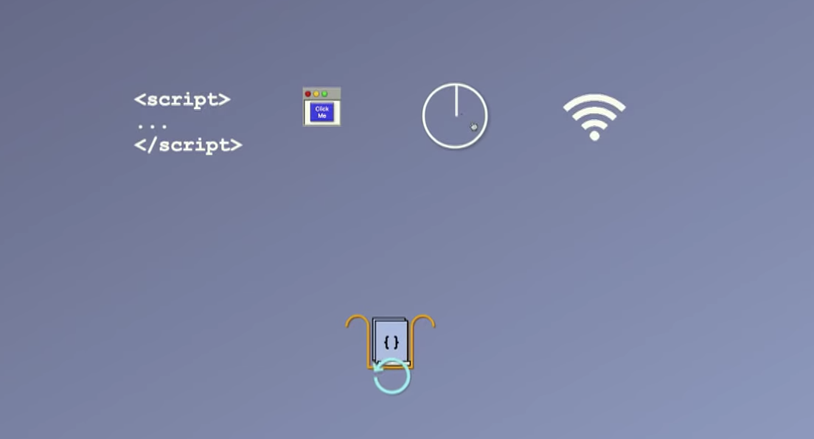
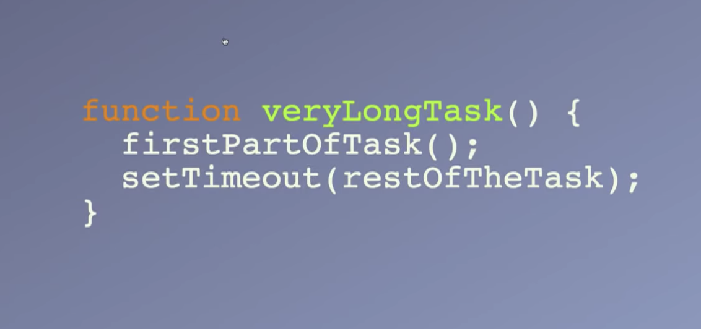
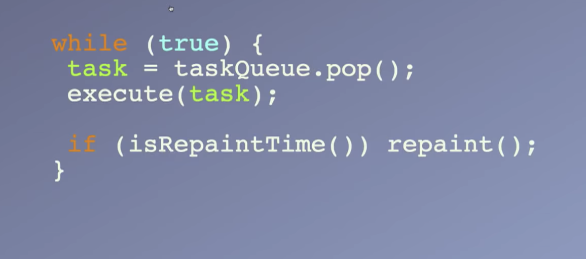
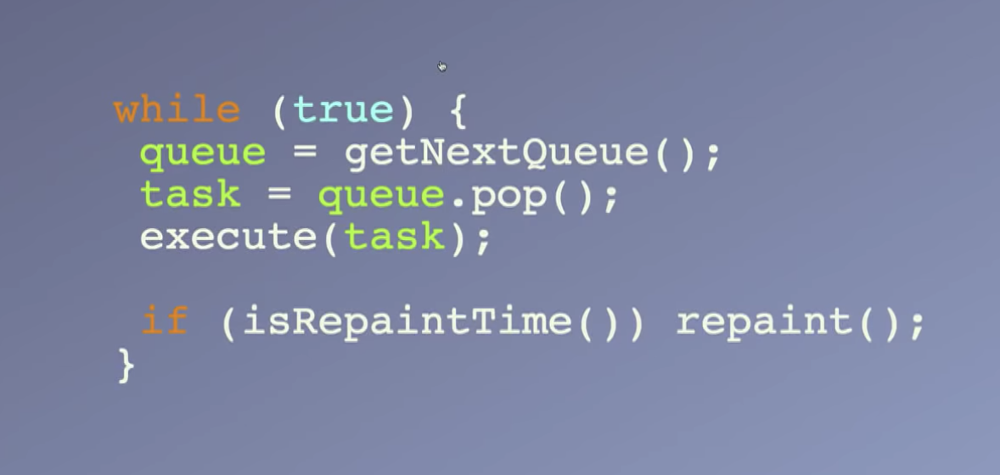

##Further Adventures of the Event Loop - Erin Zimmer - JSConf EU 2018

youtube地址: https://www.youtube.com/watch?v=u1kqx6AenYw
ppt: https://ejzimmer.github.io/event-loop-talk/#/

几年前，也是在这样的大会上，有个叫Phil Roberts的人做了一个演讲：《what the hack of eventloop anyway?》，如果你还没看过，强烈推荐你去看看，就在youtube的JSConf频道上，最后着火的场景真是太棒了，没看过也没关系，我会对和今天有关的内容做一个回顾，并且我们会更深入的了解事件循环。
你可以将事件循环认为是浏览器的一个主函数，它是一个永远不会停止的循环，它会从任务队列里拿出一个任务并运行.

很棒，但是，什么是任务呢？一个任务是js如何得到运行，如果我们有像这样一段script，浏览器会解析这段script标签并创建任务。黑色背景的代码即将变成一个任务，当它运行的时候，会创建一个变量，注册一个事件监听，然后，当浏览器得到键盘事件的时候，蓝色代码就会作为一个任务来运行，任何js通过script标签或回调函数的形式运行都能称作一个任务。

任务队列又是什么呢？我们将在浏览器，node和Web works的执行环境中来看看任务队列是什么。什么是任务队列，任务队列是用来做什么的呢？任务队列是你的js等待被执行时候所处的位置，例如解析script标签，点击事件的回调函数，setTimeout的回调函数或者一个异步请求，它们都将进入任务队列并且会得到执行。

关键的事情是，这是一个队列，所以任务将会以它们到达的顺序得到执行，先进先出，另外一个重要的事情是，一个任务会从开始运行到结束，js执行不会被中断，所以你不用担心并发，锁或者其他类似这些的垃圾，超简单的，这就是我们的事件循环。

但是，当事件循环和渲染管道一起工作的时候，事情开始变得有些复杂。渲染管道的职责是在浏览器窗口上画东西，当你改变DOM，更新样式的时候，渲染管道启动并且在屏幕上展示（你的改动）。所以，渲染管道可以在一个任务结束之后运行，任务结束，渲染管道可以运行。但是，浏览器是很聪明的，它们不会做它们不必要做的事，除非屏幕确实要更新了，不然大可不必去运行渲染管道。所以你的屏幕更新平均时间大约是一秒钟60次，也就是每16ms更新一次，如果你正在执行一个任务，渲染管道得等任务结束后的下一个16ms才能执行。这里的关键是，直到任务运行结束之后，渲染管道才能得到执行，所以如果你的任务运行花费了很长的时间，比16ms更多，浏览器就会开始丢帧，发生卡顿的情况。如果你确实有需要占用长时间执行的任务，可以将这些任务用setTimeout或者其他类似的形式进行分割，从中创建一个新的任务，先运行开始部分的任务，隔一会再运行剩下的。

也可以是用Web Works,这就是它应该做的。所以，现在事件循环看起来就像这样，我们有一个无尽的循环，在任务队列里面拿出一个任务来执行，如果到重绘的时间点，就重绘。

事情正在变得越来越复杂，如果你有看过文档，你会发现一个事件循环有一个或多个任务队列，我得承认，这里我应该额外去看浏览器的源码，看Chrominu如何去组织运行事件队列，但是我得和你们坦白，我是个JS开发者，我完全看不懂这些C++代码，所以，作为代替，我们从理论上看，浏览器应该如何运行多个事件队列，现在我们有两个任务队列，一个队列是鼠标点击事件进入的队列，另外一个是其他事件，这更简单，就像机场的商务舱排队，鼠标点击事件的任务队列会先得到清空，然后执行另外一个队列，这不会影响渲染管道，如果到它执行的时间，它还是会在一个任务之后执行。不同的队列可以以任意的次序执行，但是，队列还是队列，任务还是得遵从先进先出的顺序，相同来源的事件进入相同的队列，所以所有的鼠标点击事件会进入同一个队列，Node为setTimeout使用一个特定的队列，所有的setTimeout事件会进入那个队列，现在我们的事件循环看起来就像这样，无尽的循环，我们先挑选一个队列，其他都一样，这仍然十分直观，对吧？

事情又变的更复杂了，我们有了微任务（microtask），什么是微任务，为了20分钟内结束这次演讲，微任务就是promise，也有其他东西可以产生微任务，但是百分之99.9你会面对的就是promise。我们的微任务队列是黄色的，紧邻渲染管道，我们有一个待执行的代码，我们有待resolve的promise任务，会进入微任务队列。微任务队列有一些特别的地方，首先，每个任务执行之后，都会执行微任务列队，就算渲染管道想要执行，也要等到所有的微任务队列运行结束，如果我们在微任务队列里有许多微任务，它们都会运行，这对整个运行机制有非常重要的含义。我们来看看任务运行和微任务运行的不同之处。

