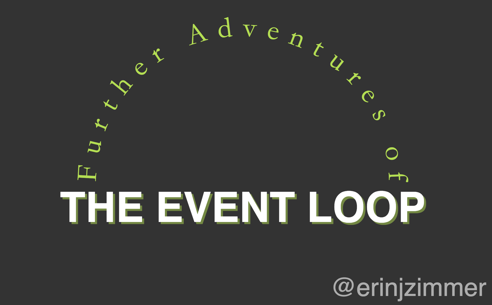

##Further Adventures of the Event Loop - Erin Zimmer - JSConf EU 2018

youtube地址: https://www.youtube.com/watch?v=u1kqx6AenYw
ppt: https://ejzimmer.github.io/event-loop-talk/#/

几年前，也是在这样的大会上，有个叫Phil Roberts的人做了一个演讲：《what the hack of eventloop anyway?》，如果你还没看过，强烈推荐你去看看，就在youtube的JSConf频道上，最后着火的场景真是太棒了，没看过也没关系，我会对和今天有关的内容做一个回顾，并且我们会更深入的了解事件循环。
你可以将事件循环认为是浏览器的一个主函数，它是一个永远不会停止的循环，它会从任务队列里拿出一个任务并运行.

很棒，但是，什么是任务呢？一个任务是js如何得到运行，如果我们有像这样一段script，浏览器会解析这段script标签并创建任务。黑色背景的代码即将变成一个任务，当它运行的时候，会创建一个变量，注册一个事件监听，然后，当浏览器得到键盘事件的时候，蓝色代码就会作为一个任务来运行，任何js通过script标签或回调函数的形式运行都能称作一个任务。

任务队列又是什么呢？我们将在浏览器，node和Web works的执行环境中来看看任务队列是什么。什么是任务队列，任务队列是用来做什么的呢？

